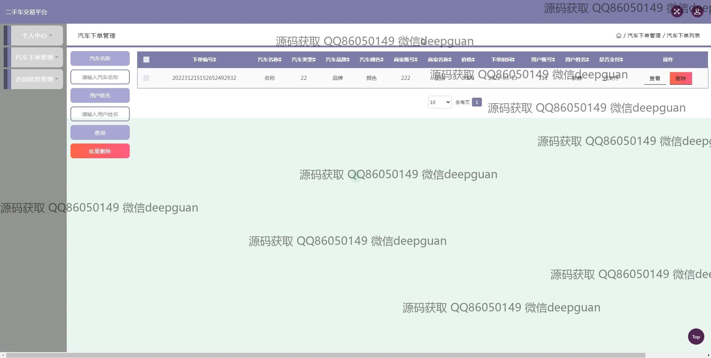

<h1 align="center">二手车交易平台的设计+jsp</h1>

## 简介
二手车交易平台：角色分为管理员、用户、商家；功能包括车辆信息管理、订单管理、合同管理、用户注册与登录、导航和查询功能，为用户提供简洁直观的交易体验。    --计算机毕业设计源码；毕设源码；java毕业设计源码

## 联系方式

<h3 align="center">获取完整代码与数据库文件 + 微信：deepguan QQ: 86050149 QQ群: 783742310</h3>

<h3 align="center">可帮忙远程部署 包运行成功！提供远程部署、修改代码、设计文档指导、代码讲解等服务！</h3>

## 功能介绍（完整见运行截图）
管理员：基本功能包括登录、注册和退出，提供后台管理接口以编辑和管理交易信息。后台管理功能涵盖用户管理、商家管理、车辆信息管理、订单管理，以及合同信息管理。管理员可以添加或更新货品信息，查看和批量处理合同，并进行系统配置与维护。

商家：主要功能为管理店铺和发布车辆信息。商家可以上传汽车图片，编辑汽车信息如名称、价格、品牌等相关详情，同时管理订单和合同，查看交易记录并与用户进行沟通。商家注册界面提供信息填写和身份验证功能，以保障账户安全。

用户：用户功能包括注册、登录和浏览网站主页，其中可以查看汽车列表、详情、并进行车辆搜索。用户可利用个人中心管理个人信息和订单，查看合同内容，以及下单购买汽车。用户可通过输入搜索条件筛选车辆，以便选择适合的二手车。

超级管理员：负责平台整体配置及权限管理，包括导航栏的设置、广告信息的更新和网站视觉内容的维护。超级管理员可监控系统运行状态，执行数据备份和风险控制，确保平台的安全稳定运营。

## 运行截图

本代码来源于网络,仅供学习参考使用!

